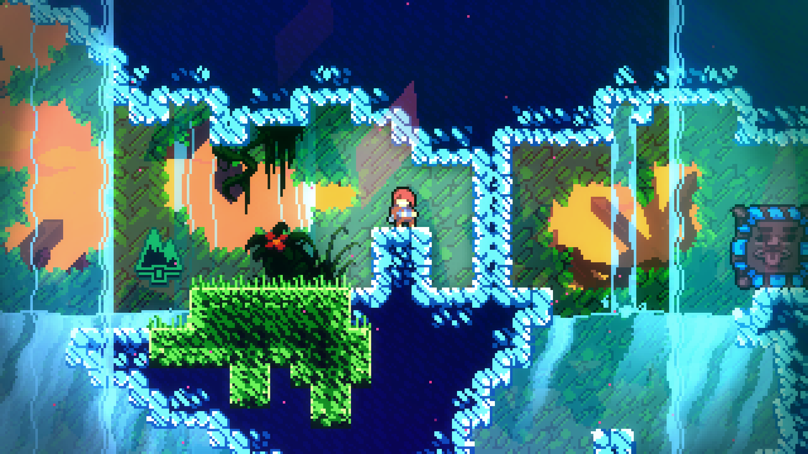

# 1.3 Research

## Existing Solution 1: Celeste

<figure><figcaption>
Celeste gameplay (<em>IGN, n.d.</em>)
</figcaption></figure>

### Overview

Celeste is a 2D platformer game released in 2018 by Extremely OK Games. In this game, a young woman called Madeline has to climb up Celeste Mountain whilst facing obstacles from both the mountain and herself (_Celeste Wiki, n.d._).

### Aspect 1: Controls

With this game you can do many different moves, something that is not needed for my game. However there are some basic controls, such as those for moving and jumping, respectively moving the left stick, and the A or Y buttons (_Neoseeker, n.d._). Those controls are for a console controller, such as that of an Xbox - my game is for computers and would just use the arrow keys (and/or WASD) for moving and jumping. The controls are described as 'simple to learn and hard to master' (_Celeste Wiki, n.d._). The 'hard to master' aspect of this means the game will most likely not be suitable for younger players (it is rated PEGI 7) (_videostandards.org.uk, n.d._). As mentioned before, my game will most likely be PEGI 3 as the controls are most definitely easy to learn, but I would not call them hard to master.

### Aspect 2: Platforming

The platforming element is a strong element of Celeste. There are many different types of platforming, from more bog-standard stuff, such as that in the picture above, to much more complicated stuff involving many different types of move. The levels are described as 'challenging' as they require lots of skill in terms of using the controls (_Celeste Wiki, n.d._). The above picture shows a certain part of a level. You can see that there is a jump that looks very challenging. Some of the platforming in this game would require certain moves, something which the mathematical platformer would not need, and the difficulty of the platforming would depend on the difficulty selected. Also, the platforming would be less complicated in general - there are many different moves in this game which I simply won't need.

### Features




| Feature                   | Justification                                                                                                                                                                                                    |
| ------------------------- | ---------------------------------------------------------------------------------------------------------------------------------------------------------------------------------------------------------------- |
| The more 'basic' controls | if the game has basic controls it will be easier for people to understand and to play. This is useful for a wide range of audiences. I will most likely just use arrows and/or WASD for this.                    |
| Colours (to an extent)    | Celeste's levels have a wide range of colours, and games are more interesting if they are colourful. Although my game's colours will be nowhere near as complex as Celeste's, I hope to add some form of colour. |
| Platforming               | I want to try and keep some of the platforming aspect of this game. I could add things such as wall climbing to my game to add a bit more variation without making it too complex for my demographic.            |



| Feature          | Justification                                                                                                                                   |
| ---------------- | ----------------------------------------------------------------------------------------------------------------------------------------------- |
| Storyline        | this would probably not be necessary for a mathematical platformer, as the game is intended to be educational too.                              |
| Different worlds | again, I don't think this would be necessary. Although having different worlds makes the game more interesting, it adds unnecessary complexity. |
| Objects          | Celeste has many different objects that the player can use. This would be too complex for the mathematical platformer.                          |



## Existing Solution 2: Math Rescue

<figure><figcaption>
Math Rescue gameplay (<em>store.steampowered.com, n.d.</em>)
</figcaption></figure>

### Overview

Math Rescue is a mathematical game with platformer elements, released in 1992 mostly for computer-based platforms. You solve maths questions whilst trying to get back the numbers which were stolen by the Gruzzles (_store.steampowered.com, n.d._).

### Aspect 1: Maths

Maths is a central part of Math Rescue. You can choose whether to have questions solely based on addition, on subtraction, on multiplication or on division, or you can choose the 'mixed' option, giving you all four operations (_store.steampowered.com, n.d.)_. You can also have word problems if you want (where the questions are written with sentences), which is useful for young children who are learning maths (_www.youtube.com, n.d._). I will use the former feature for my game, and if I have time, I will try to incorporate word problems too.

### Aspect 2: Platforming

Platforming is a strong part of Math Rescue. To get to the maths questions, you must hit a box with your head (like the boxes in Mario), where you will be presented with a maths question. In the questions you must also hit boxes with your head in order to write out the answer. There are also other platformer elements, for example, you can pick up objects in the air to score points. Solving the maths questions also gives you points, as does covering enemies with slime. The above picture shows a certain part of gameplay. There are basic platforming controls: moving left to right and jumping, which makes the game more accessible to the younger market it targets - Math Rescue is marketed for ages 6 and up (_store.steampowered.com, n.d._).




<table><thead><tr><th>Feature</th><th>Justification</th><th data-hidden></th></tr></thead><tbody><tr><td>Maths aspects</td><td>maths will be an integral part of the mathematical platformer, so this is an absolute must. I will try to incorporate both number- and word-based problems.</td><td></td></tr><tr><td>Platforming</td><td>again this will be integral to my game. The platforming will have to be fun and suitable for younger players. It should be varied too.</td><td></td></tr><tr><td>Colours</td><td>Math Rescue has a good range of colours in it, from the NPCs to the background, and I hope to add colour to my game.</td><td></td></tr></tbody></table>




<table><thead><tr><th>Features</th><th>Justification</th><th data-hidden></th></tr></thead><tbody><tr><td>Storyline</td><td>Math Rescue has a storyline about aliens stealing numbers. This would not be necessary for the mathematical platformer - it adds needless complexity.</td><td></td></tr><tr><td>Objects</td><td>you can pick up objects for points - the mathematical platformer will give you points for answering questions correctly only.</td><td></td></tr><tr><td>Different playable characters</td><td>my game will probably not have different characters in it, so there is no need to spend time creating different personas for the person to choose from.</td><td></td></tr><tr><td>Objects for scoring points</td><td>the points will be obtained from getting questions right with the enemies as a side challenge. The points system of Math Rescue would not be needed for my game.</td><td></td></tr></tbody></table>



## Existing Solution 3: Donkey Kong Jr. Math

<figure><figcaption>
<em>Nintendo of Europe GmbH, n.d.</em>
</figcaption></figure>

### Overview

Donkey Kong Jr. Math is an educational Donkey Kong game, originally released in 1983. You have to solve maths problems by climbing vines to get to the numbers. There are addition, subtraction and multiplication problems. There are single- and two-player modes (_Nintendo, n.d._).

### Aspect 1: Maths

In this game, in the single-player version, you are given a maths question. You must work out the answer, and then write it out by climbing and jumping between the vines to get to the numbers. In the single-player version, if you get too many questions wrong, you lose a life. It is game over if you lose all your lives, as with many platformers. You can also lose (in both single- and two-player versions) by falling into the water (_Nintendo, n.d._) In the two-player variant, you are given a number, and you must use the numbers and operation signs to get to that number (e.g. for 18, get a 3, the x symbol and a 6). For the operations, they are on platforms on the ground. Whoever gets to the number first wins (_www.youtube.com, n.d._).. The platforming of the mathematical platformer will be more standard than in Donkey Kong Jr. Math, as to keep things simple enough.

### Aspect 2: Platforming

As with Math Rescue, platforming is also an integral part of the game, despite the game being marketed as educational. In Donkey Kong Jr. Math, you must climb and jump between vines to get to the numbers in order to answer the questions. You can also jump between platforms on the ground and in the air, and you can run on these platforms (_www.youtube.com, n.d._). All in all, it is very similar to the original Donkey Kong, so anyone familiar with that game should have no problems with this one.



<table><thead><tr><th>Feature</th><th>Justification</th><th data-hidden></th></tr></thead><tbody><tr><td>Platforming aspects</td><td>my game will be a platformer, therefore there will be platforming, but it will be of a more generic Mario-esque style, not like Donkey Kong with vines.</td><td></td></tr><tr><td>Maths aspects</td><td>maths will be an integral part of my game, so I must include maths in it. I will try to add different difficulties as well as, if I have the time, more complex operations, such as raising to the power.</td><td></td></tr><tr><td>Simplicity</td><td>Donkey Kong Jr. Math has many simple aspects (e.g. the basic four operations) that I will use for my game.</td><td></td></tr></tbody></table>



<table><thead><tr><th></th><th></th><th data-hidden></th></tr></thead><tbody><tr><td>Multiplayer</td><td>this will be a single-player game only, as I do not have the time to incorporate multiplayer aspects.</td><td></td></tr><tr><td>Life system</td><td>the objective of my game will be to get as many questions right in a row. If you get the wrong answer or hit an enemy, it will be game over. You will see how many questions you got right.</td><td></td></tr><tr><td>Character designs</td><td>although a good character design is nice for a game, creating the right one would be too time-consuming, so I will stick to simple designs for the player-controlled sprites.</td><td></td></tr></tbody></table>


