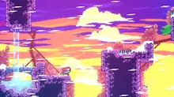

# 1.3 Research

## Existing Solution 1: Celeste

<figure><figcaption>
Celeste gameplay (<em>Celeste Wiki, n.d.</em>)
</figcaption></figure>

### Overview

Celeste is a 2D platformer games released in 2018 by Extremely OK Games. In this game, a young woman called Madeline has to climb up Celeste Mountain whilst facing obstacles from both the mountain and herself (_Celeste Wiki, n.d._).

### Aspect 1 (of 2-4 aspects per solution?)

A more detailed description of some aspect of this solution

### Features



| Feature             | Justification                               |
| ------------------- | ------------------------------------------- |
| Feature description | Some reason it's a good fit in this project |



| Feature             | Justification                                              |
| ------------------- | ---------------------------------------------------------- |
| Feature description | Reason it's beyond the scope/not suitable for this project |


