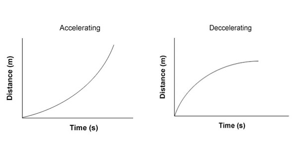
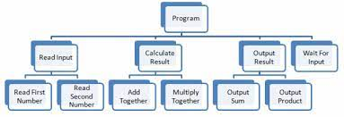
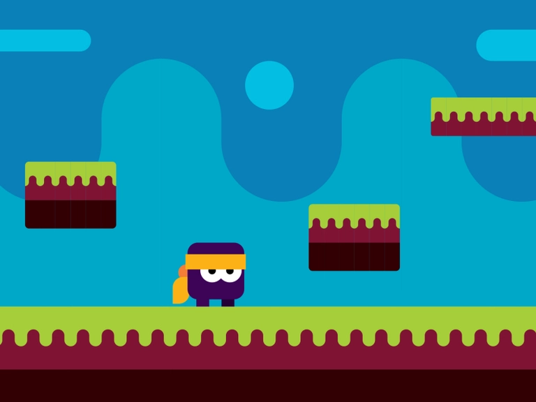

# 1.4a Features of Proposed Solution

## Game Mechanics

<figure><figcaption>
Linear acceleration and deceleration (<em>Walden, 2019</em>)
</figcaption></figure>

### Movement

The movement mechanics in the mathematical platformer will be simple. I will use a 'linear acceleration' system for the character, where it accelerates at a linear pace to a set top speed. For deceleration, it will decelerate at a linear pace until stopping. For jumping, there will not be a linear system: the jump height will be the same each time. The character will not be allowed to clip through walls, so hitting a wall will stop the character from proceeding in the direction of the wall. A collision detection system will allow this. A linear acceleration system is more realistic as no-one instantly stops in real life and might be more fun to use than a single-speed system as it adds a bit more of a challenge to the platforming aspect of this game.

### Controls

The controls will be very simple for this game. The only controls necessary are the arrow keys and/or WASD to move the character. As these are a well-known way to control characters on computer games, this makes the game more accessible. The up arrow and/or W would make the character jump, the left arrow and/or A would accelerate the character in the left-hand direction, and the right arrow and/or D would accelerate the character in the right-hand direction. I cannot think of a use for the down arrow and/or S. The other control that will be needed is pressing the mouse button to press buttons on the menu and other screens. This will be easy to implement in Kaboom with the onMousePress function.

## Graphics and UI

<figure><figcaption>
Flappy Bird, a game with simple graphics (<em>www.bloomberg.com, n.d.</em>)
</figcaption></figure>

### Graphics

The graphics in the mathematical platformer will be kept simple, as I want to try and concentrate on gameplay. However, I want to try and add some colour to the game, so it is not quite so monotone and boring. I have the idea that the background colour could vary with each level, which will be done by changing the colour values, but I would need to make sure it does not clash with the colour of the character, enemies or any other sprites. I could solve this by adding an outline to the sprites to distinguish them from the background. I could also add different themes to the backgrounds (e.g. forest, desert etc.) so there is more of a contrast. Contrasting colours will make it more obvious as to what it what, and makes the game easier to understand. The platforms will have a texture on them so they are also easily distinguishable - I have not decided what the texture will be yet.

### User Interface

The user interface in my game will be simple and easy to understand. For the title and difficulty selection screens, there will just be buttons to (respectively) enter the difficulty selection screen and choose a difficulty. The graphics will be very basic for this, as in just a plain screen with plain text - likewise in the levels, there does not need to be a fancy graphics interface - aside from the colours mentioned in the 'Graphics' section, there only needs to be a score counter and other text snippets for the questions and answers. The text can all be superimposed with the text() function in Kaboom. As mentioned before, I want to concentrate on gameplay more, so the graphics and UI might be pushed back and might not look as nice as some other games out there. If everything is simple, younger players could find it easy to understand, and more accessible as a result.

## Level design and features

### Level design

<figure><figcaption>
Simple 2D level design (<em>Dribbble, n.d.</em>)
</figcaption></figure>

The levels will be simple in their design. There will be platforms that allow the character to access answers, and there will be enemies spawned on various platforms that move around randomly, which the player must avoid. The collider of the area() function in Kaboom will detect when the player is on a platform. I will probably not make different level designs but, in terms of obstacles and enemies, I will try to randomise these to an extent. The textures and colours have been mentioned previously, but these will be simple enough as to not confuse young players who might be playing this game.

### Enemies

As this is a platformer game, it would not make sense to not have enemies, therefore they will be included. The enemies are AI characters that kill the player and stop the game if the player touches one of their hitboxes. They will be rendered as sprites, like the player, and will have the same area() and body() properties as the player too. I will make it so that the enemies spawn in a random position on the level grid (but never within a certain distance of the player's starting position) and move around in a linear fashion (like the enemies in Mario games). They will respond to physics and gravity in the same way as the player. The number and speed of the enemies will depend on the difficulty selected. For example, the easiest setting could have no enemies, and the hardest setting could have many.

### Obstacles

There will also be obstacles in the mathematical platformer, as they are another core feature of a platformer game. The obstacles will be simple ones such as blocks and spikes. They will also be rendered as sprites, and will have colliders like the players, enemies and answer text. Blocks will hinder the player by stopping their movement in the block's direction, whereas spikes, like enemies, will kill the player if they come into contact with their hitboxes. As with the enemies, I plan to make them spawn randomly (but not on the player's starting point) so that there is more variance in the levels.

### Answers

The answers to a particular maths question will be generated on platforms on each side of the screen, and will have a collider to detect the player coming into contact with them. One of the answers will be 'correct', where the player is sent to the next question or the win screen, and the others will be 'incorrect', where the player is sent to the game over screen. The text will not be rendered as sprites, as Kaboom has an option to render as text.

## Limitations

### Limitation 1 - Levels

Due to time constraints, I will probably not be able to include different level designs - if I can then there will only be three maximum. I will try to make the core level design good enough first, before thinking about other level designs. I do not want a discrepancy in design quality on the levels, so I will concentrate on just one.

### Limitation 2 - Multiplayer

A multiplayer mode would be nice for players to compete in who could get to the answer the quickest, and could add an extra layer of fun to the game. However, a multiplayer function is time-consuming and quite hard to implement and could require extra needs in terms of computers. Therefore, I will not include a multiplayer function in the mathematical platformer. I could make it so that two players use the same keyboard in order to have a two-player game, but this would be unwieldy for the players.

### Limitation 3 - Graphics and UI

Due to time constraints, I might not be able to include particularly fancy graphics. Also, as mentioned in the 'Graphics' section, I want to concentrate on gameplay in order to make the game more fun, so fanciness will be an afterthought. With the user interface, it will also be simplistic, as again I cannot make it too fancy due to gameplay prioritisation and time constraints. It will have everything that is necessary, but not much more, if anything more.

### Limitation 4 - Performance

As this game will only be run in a browser, its performance capabilities will be limited by the browser. Different browsers might have different speeds so how fast the game moves and how easy it is to control will depend on which one is used to run the game.
