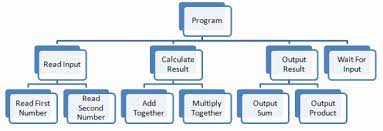

# 1.4b Computational Methods

## Thinking Abstractly and Visualisation

Abstraction is the process of removing unnecessary detail from something to focus on the core details. This can be used in problem-solving, where you remove anything that is not necessary, leaving you with the core details to concentrate on, allowing you to solve the problem more easily. Here are some abstracted key features of my game.

* The designs will be basic. I will make the design look nice, but not complicated as to keep the game simple. There will be a range of colours as to keep the game varied. Likewise, the graphics will be basic.
* The level will be basic enough too. It will have a basic layout which is easy to understand, but there can be some randomness to the layout for variation.
* The user interface will tell the player everything they need to know and no more. There will be text for the score, and for the question and answers. Outside of the gameplay, there just needs to be buttons with text and nothing else.
* The enemies will kill the player if they touch one of them, and they will move around on the platforms. Any enemies and other obstacles will spawn randomly, but not within a certain distance of the player's starting position.
* The obstacles will spawn randomly, but again not within a certain distance of the player's starting position. Said obstacles will hinder the player in different ways - for example, spikes will kill the player if they touch them.

This is abstract information - the parts of the game have been broken down into small chunks as to help me solve the problem of how to make the game more easily.

## Thinking Ahead

Thinking ahead in program building requires you to take the initial abstract model and develop on it. You can work out the first things you will need to do in your project by thinking ahead. By doing this, you can solve problems such as:

* What are the inputs and outputs?
* What preconditions are there for the solution?
* How will I make the program more efficient?

Thinking ahead is vital in programming as if you do not think ahead, you will run into problems later on in development, which will most likely have been caused by malpreparation and not covering the first bits well enough.

For an example of thinking ahead and developing on the abstracted model, the player inputs for my game will be the player pressing the arrow keys or WASD so the player's character moves (which is the output). Some preconditions are that the player cannot clip through a wall, so movement will not be allowed if it would cause the player to do so, and that there will not be movement when the game is not on the level screen, as the character (and any other AI, for that matter) would not be on the screen.

I know that some decisions must be made early on in the project (this is a core part of thinking ahead); these include things such as what platform I will use (Kaboom JS), what controls I will use (arrow keys/WASD), and what core features the project will have (such as the maths aspect).

Operating systems think ahead by caching. This is where they store data and/or instructions so they can be easily reloaded. Caching is useful as it makes doing certain things quicker when they are done a lot. However, it uses memory, so cache needs to be cleared every now and again.

## Thinking Procedurally and Decomposition

Decomposition is when you break a problem down into small parts, which can then be broken down into even smaller parts that can be as small as simply performing a single function. Each part is then done in a certain order. Decomposition is part of thinking procedurally, which is useful for program building as it allows you to do each part of the project in manageable chunks and in the best order. I will need to decompose my project into ordered chunks (e.g. coding the character movement, coding the questions and answers, coding enemies, etc.) so it can be made in the most efficient way.

<figure><figcaption>
An example of a hierarchy chart (<em>www.multiwingspan.co.uk, n.d.</em>)
</figcaption></figure>

A good way to help decompose a problem is by drawing a 'hierarchy chart'. A hierarchy chart is a chart where the problem is on the top, and it is then broken down into smaller parts, as mentioned above. The breaking down continues until there are parts that are for performing a single function. The functions are then executed from left to right. There are 'levels' of a hierarchy chart: The level at the top of the picture above is not named, then the next levels down are level 1, level 2, etc. The more levels a certain function has, the more complex said function is.

<figure><figcaption>
An example of good code, in that it is readable (<em>Avdeyuk, 2023</em>)
</figcaption></figure>

Thinking procedurally also involves good programming practices, such as commenting your code well, using suitable names, and using sub-procedures (which should each perform a single task). This all makes your code easier to work with and less likely to have errors.

## Thinking Logically

Thinking logically is the idea of making a good solution to a problem with logical thinking, i.e. thinking that makes sense. This is a great tool to have when designing a program. A good program should be logical: it should work for all inputs, including by rejecting invalid inputs, it should be efficient, using as few steps as possible, and most of all it should be understandable. Thinking logically is helped by using hierarchy charts and other tools.

## Thinking Concurrently
