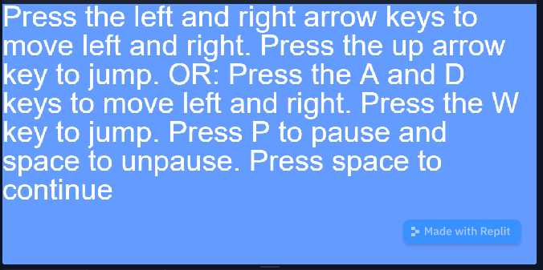

# 2.2.12 Cycle 12

## Design

### Objectives

For cycle 12, I would like to implement the remaining features from my success criteria. These include a pause function, a 'try again' option for the end screens, and linear acceleration.

* [x] Implement a pause screen
* [x] Implement 'try again' options
* [x] Implement linear acceleration

### Usability Features

Engaging: The player will not have to press as many buttons to restart a game.

Efficient: Same as above.

### Key Variables

<table><thead><tr><th>Variable name</th><th>Use</th><th data-hidden></th></tr></thead><tbody><tr><td>onKeyPress</td><td>Does an action when a key is pressed. Certain keys can be specified.</td><td></td></tr><tr><td>debug.paused</td><td>Sets the 'paused' value to true or false, pausing or unpausing the game.</td><td></td></tr></tbody></table>

### Pseudocode

```
//Try again code
onKeyPress "T"
    go "game"
onKeyPress " "
    go "start"

//Pause code
onKeyPress "p"
    pause
onKeyPress " "
    unpause
```

## Development

### Outcome

So far, I have implemented two of the three features mentioned in the objectives section. I have also made other minor changes, such as updating the instructions screen.

```
//Code for a 'try again' function
onKeyPress("space", () => {
        go("start"); //to go to the start screen again
})
onKeyPress("t", () => {
        go("game"); //to restart
})

//Code for a 'pause' function
onKeyPress("p", () => {
    debug.paused = true;
    onKeyPress("space", () => {
        debug.paused = false;
    })
})
```

### Challenges

Originally, I could get the game to pause, but not unpause. I found out that I needed to update the Kaboom, so I did so and the unpause worked properly.

## Testing

### Tests

| Test | Instructions                                            | What I expect                  | What actually happens | Pass/Fail |
| ---- | ------------------------------------------------------- | ------------------------------ | --------------------- | --------- |
| 1    | Press T on the try again screen after winning           | The game starts again          | As expected           | Pass      |
| 2    | Press space on the try again screen after winning       | The game goes to the main menu | As expected           | Pass      |
| 3    | Press T on the try again screen after losing            | The game starts again          | As expected           | Pass      |
| 4    | Press space on the try again screen after losing        | The game goes to the main menu | As expected           | Pass      |
| 5    | Press p when in a game                                  | The game pauses                | As expected           | Pass      |
| 6    | Press space on the pause screen                         | The game resumes               | The game stays paused | Fail      |
| 7    | Press space on the pause screen (after updating Kaboom) | The game resumes               | As expected           | Pass      |

### Evidence



The new win screen with the 'try again' option.

.png>)

The new game over screen with the 'try again' option.

.png>)

The new instructions screen.

.png>)

Here, the game is paused, as implied by the pause icon in the top-right corner.
