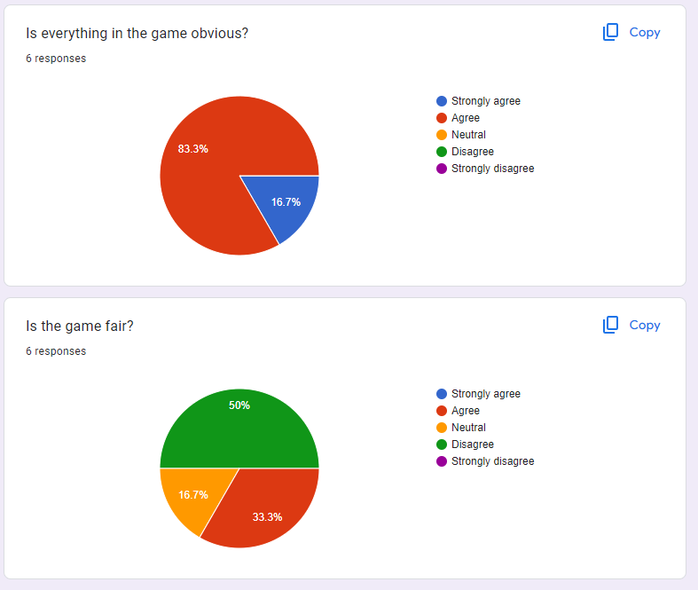

# 4.1 Evaluation of Success Criteria

### Level layout and design

<table><thead><tr><th>Ref. No.</th><th width="212">Criterion</th><th width="208">Justification</th><th width="166">Reference</th><th>Met?</th></tr></thead><tbody><tr><td>1</td><td>The level should be composed of platforms that are generated randomly</td><td>The level needs to have a layout that is not the same and repetitive</td><td><ul><li><a href="../../analysis/1.4a-features-of-the-proposed-solution.md#level-design">Level design</a></li></ul></td><td>Met</td></tr><tr><td>2</td><td>Everything on the level screen needs to be obvious to the player</td><td>This game is supposed to be accessible for everyone, so they need to know what to do</td><td><ul><li><a href="../../analysis/1.2-stakeholders.md">Stakeholders</a></li></ul></td><td>Met</td></tr><tr><td>3</td><td>The player should not immediately die upon starting a level</td><td>The game must also be fair. An unfair game is not accessible</td><td><ul><li><a href="../../analysis/1.2-stakeholders.md">Stakeholders</a></li><li><a href="../../analysis/1.4a-features-of-the-proposed-solution.md#enemies">Enemies</a></li><li><a href="../../analysis/1.4a-features-of-the-proposed-solution.md#obstacles">Obstacles</a></li></ul></td><td>Partially met</td></tr><tr><td>4</td><td>Obstacles (blocks and spikes) must be generated onto the level, and spikes must kill the player when touched</td><td>Obstacles create an extra challenge for the player, which makes a game more fun</td><td><ul><li><a href="../../analysis/1.4a-features-of-the-proposed-solution.md#obstacles">Obstacles</a></li></ul></td><td>Met</td></tr><tr><td>5</td><td>Enemies must be generated onto the level, and they must kill the player when touched</td><td>Enemies also add a challenge for the player, and they contribute to AI</td><td><ul><li><a href="../../analysis/1.4a-features-of-the-proposed-solution.md#enemies">Enemies</a></li></ul></td><td>Met</td></tr><tr><td>6</td><td>Questions and answers must be generated onto the level, and one answer must be correct</td><td>This is a core part of the game, as there is an educational side to it too</td><td><ul><li><a href="../../analysis/1.4a-features-of-the-proposed-solution.md#answers">Answers</a></li></ul></td><td>Met</td></tr><tr><td>7</td><td>Enemies and obstacles must be generated at a distance away from the player</td><td>This ties in with point 3: it is unfair for the player to die upon starting a level</td><td><ul><li><a href="../../analysis/1.2-stakeholders.md">Stakeholders</a></li><li><a href="../../analysis/1.4a-features-of-the-proposed-solution.md#enemies">Enemies</a></li><li><a href="../../analysis/1.4a-features-of-the-proposed-solution.md#obstacles">Obstacles</a></li></ul></td><td>?</td></tr></tbody></table>

### Criterion 1

This criteria is for adding randomly generated platforms to each level screen. I have achieved this success criterion by adding code to randomly generate three platforms on a certain level (y-position), with there being three different levels for a total of nine platforms. This adds a random aspect to the game, making sure that no level is the same, increasing replayability value. This success criterion is fully met.

### Criterion 2

This criteria states that everything must be obvious to the player. Here is an example of a level screen:

<figure><figcaption></figcaption></figure>

There are platforms to jump on, spikes and an enemy to avoid, answers to hit, and a score counter. This is all that there needs to be on the level screen. Likewise, as seen previously, the other screens are just text. Therefore, I would say that everything is obvious to the player, and that I have met this criterion.

### Criterion 3

The player must not immediately die when a level is started. In recent playtesting I have not had any instant deaths, but sometimes there has been very little time to react before dying because an enemy is instantly coming towards you. Therefore I would say this criterion is partially met.

### Criterion 4

This criterion states that there must be blocks and spikes on the level, and that spikes must kill the player when touched. I did not add blocks, but I have added spikes on each side of the floor, and as they are marked with "danger", they will kill the player when touched. They are generated onto the level each time one is loaded. There are spikes, but not 'blocks' or another obstacle, so this is partially met.

### Criterion 5

This criterion is for generating enemies onto the level that kill the player when touched. When 1, 2 or 3 is selected on the difficulty screen, respectively 1, 2 and 3 enemies are generated, meeting the requirements for this success criterion. They are marked with "danger" therefore they kill the player when touched. They move left and right across the level too.

### Criterion 6

Questions must be generated onto every level. This is the case, and there are addition, subtraction and multiplication questions for variation. Answers must also be generated onto the level. This is also the case, and their positions are randomly generated, fully meeting this criterion. The three incorrect answers are random too, adding to the replayability value, crucial for games like mine.

### Criterion 7

To avoid unfair deaths, enemies must be generated away from the player. This ties in with [criterion 3](1.5-success-criteria.md#criterion-3), so it is partially met. Enemies are generated away form the player somewhat, but they can immediately come towards the player, so there can be very little time to react properly before being hit and dying. Obstacles (i.e. spikes) are always generated away from the player.

### User Interface

<table><thead><tr><th width="97">Ref No.</th><th width="203">Criterion</th><th width="208">Justification</th><th>Reference</th><th>Met?</th></tr></thead><tbody><tr><td>8</td><td>The game should have a simple-to-understand menu</td><td>It should be obvious how to access the game, and it should look good, as for a good first impression</td><td><ul><li><a href="../../analysis/1.4a-features-of-the-proposed-solution.md#user-interface">User Interface</a></li></ul></td><td>Met</td></tr><tr><td>9</td><td>The game should have a difficulty screen</td><td>To make the game more fun for everyone, there should be options to make the game easier or harder</td><td><ul><li><a href="../../analysis/1.4a-features-of-the-proposed-solution.md#user-interface">User Interface</a></li></ul></td><td>Met</td></tr><tr><td>10</td><td>The game should have a score function</td><td>It is useful for the player to know how many questions they have got right</td><td><ul><li><a href="../../analysis/1.4a-features-of-the-proposed-solution.md#user-interface">User Interface</a></li></ul></td><td>Met</td></tr><tr><td>11</td><td>The game should have a pause function</td><td>This is useful for accessibility, as it means players can come back to a level after a short while</td><td><ul><li><a href="../../analysis/1.4a-features-of-the-proposed-solution.md#user-interface">User Interface</a></li></ul></td><td>Met</td></tr><tr><td>12</td><td>At the end of a game, there should be options to try again or to return to the menu</td><td>This is also good for accessibility, and it makes the game feel more complete</td><td><ul><li><a href="../../analysis/1.4a-features-of-the-proposed-solution.md#user-interface">User Interface</a></li></ul></td><td>Met</td></tr></tbody></table>

### Criterion 8

The game must have a menu that is easy to understand, so that the game is accessible for my wide age-range target. Here is the menu screen or home screen, with sizing instructions:

<figure><figcaption></figcaption></figure>

There is only text, and I would say the instructions shown here are simple enough to understand. Therefore the success criterion is passed.

### Criterion 9

The game should have a difficulty selection screen with options for the difficulty, so the player can have the game easier or harder for more accessibility. Here is the difficulty screen:

<figure><figcaption>
Please note that changing the difficulty only changes the number of enemies.
</figcaption></figure>

The instructions are very clear for the player, aiding anyone who wants to play, so this criterion is passed too.

### Criterion 10

The game should have a score function so the player knows how many questions they have got right. The score can be seen in the image for [criterion 1](1.5-success-criteria.md#criterion-1) and it is very clear to see below the floor. A score function can keep the user engaged by letting them know their progress. Once the score reaches 10, the game ends and the win screen appears. I have met this point in full.

### Criterion 11

This criterion states that the game should have a pause function. If a player wants to stop the game and come back later, they can do so by pressing P on a game, and pressing space to unpause. Therefore, this criterion is fully met, as everything it needs is there. The pause function can also be seen in the image for [criterion 1](1.5-success-criteria.md#criterion-1). This increases accessibility for players who will need a break after a certain amount of time playing.

### Criterion 12

At the end of a game, there should be options to try again or return to the main menu. These options can make the game feel more complete, and even more accessible. Here they are:

<figure><figcaption>
Version shown after losing.
</figcaption></figure>

<figure><figcaption>
Version shown after winning. In both cases, testing has shown that both options work correctly. Therefore, I have passed criterion 12.
</figcaption></figure>

### Mechanics

<table><thead><tr><th width="103">Ref No.</th><th width="196">Criterion</th><th width="235">Justification</th><th>Reference</th><th>Met?</th></tr></thead><tbody><tr><td>13</td><td>The character must be able to move left and right</td><td>If you cannot move a character properly, there is not much of a game to play</td><td><ul><li><a href="../../analysis/1.4a-features-of-the-proposed-solution.md#movement">Movement</a></li></ul></td><td>Met</td></tr><tr><td>14</td><td>The character must be able to jump</td><td>Jumping is vital for getting to the correct answer, and for the platformer aspect of this game in general</td><td><ul><li><a href="../../analysis/1.4a-features-of-the-proposed-solution.md#movement">Movement</a></li></ul></td><td>Met</td></tr><tr><td>15</td><td>The movement should use 'linear acceleration'</td><td>This gives the game more realistic physics, making the game more fun and more challenging</td><td><ul><li><a href="../../analysis/1.4a-features-of-the-proposed-solution.md#movement">Movement</a></li></ul></td><td>Met</td></tr><tr><td>16</td><td>The controls should be either the arrow keys and/or WASD</td><td>These are common ways to control a character on a computer game, and since many people have used these keys to control a character before, it maximises accessibility</td><td><ul><li><a href="../../analysis/1.4a-features-of-the-proposed-solution.md#controls">Controls</a></li></ul></td><td>Met</td></tr><tr><td>17</td><td>Enemies should respond to physics in the same way as the player</td><td>This adds some realism to the game, and physics that are as realistic as possible are more fun to use</td><td><ul><li><a href="../../analysis/1.4a-features-of-the-proposed-solution.md#enemies">Enemies</a></li></ul></td><td>Partially met</td></tr><tr><td>18</td><td>The player and any enemies must not clip through platforms and obstacles</td><td>Clipping through solid objects is a common error that must not be overseen</td><td><ul><li><a href="../../analysis/1.4a-features-of-the-proposed-solution.md#movement">Movement</a></li></ul></td><td>Met</td></tr></tbody></table>

### Criterion 13

As this is a platformer game, it is necessary for the player to be able to move sideways: this is an essential part of the game's functioning. The character must move left and right for my game as it is an open level game. The player is able to do this using both the left and right arrow keys, or the A and D keys (from WASD). This point is fully met as a result.

### Criterion 14

There are platforms for the player to jump on to reach the answers if necessary, so the player must be able to jump properly. Again, this is an integral part of the game's mechanics and functionality. The player can jump with the W key or the up arrow key, so this criterion is fully met.

### Criterion 15

To make my game more fun and more challenging for its players, adding extra features to improve the game's physics is a good idea. Realism in these sorts of games is not completely necessary, but it can make a game feel more complete. I have tried to add 'linear acceleration' where the character accelerates instead of moving at a constant speed all the time, and it works in itself, although pressing left and right at the same time can cause the character to go at an unintentionally high speed, so the criterion is mostly met.

### Criterion 16

The game's controls should be the arrow keys and/or WASD. Having two different methods of input increases accessibility: left-handed players can use WASD whilst right-handed players can use the arrow keys. I have incorporated both input options into my game and they both work as intended, fulfilling this success criterion.

### Criterion 17

To add to the physics realism mentioned in [criterion 15](1.5-success-criteria.md#criterion-15), the game's enemies should respond to physics in the same way as the player. This is true of the mathematical platformer, as the enemies fall by gravity in the exact same way as the player, and they can move along the ground and platforms in the same manner as the player can too. However, this criterion is not fully met because the enemies do not use linear acceleration.

### Criterion 18

To have a bug-free game, the objects, characters, etc. of a game must not clip through things. For example, the player must not glitch through platforms, and neither must the enemies. I am not aware of any clipping in my game, as I have playtested it quite a few times and I have not seen clipping, so I have met this point.

### Non-functional

These are features which are not descriptions of functionality. They are more like suitability, such as age rating appropriateness, or performance of algorithms/response times for UI etc.

<table><thead><tr><th>Ref. No.</th><th>Criterion</th><th width="243">Justification</th><th>Reference</th><th>Met?</th></tr></thead><tbody><tr><td>19</td><td>The game must follow the requirements of PEGI 3</td><td>This is the lowest PEGI rating, and my game should be suitable for everyone</td><td><ul><li><a href="../../analysis/1.2-stakeholders.md#demographics">Demographics</a></li></ul></td><td>Met</td></tr><tr><td>20</td><td>The game should not crash</td><td>Game crashing is frustrating for players, and most well-polished games do not crash when running normally</td><td><ul><li><a href="../../analysis/1.1-problem-identification.md">Problem Identification</a></li></ul></td><td>Met</td></tr><tr><td>21</td><td>The game should run smoothly</td><td>Games that are choppy are not fun to play. Ideally my game would run at at least 30 frames per second, preferably more.</td><td><ul><li><a href="../../analysis/1.1-problem-identification.md">Problem Identification</a></li></ul></td><td>Partially met</td></tr><tr><td>22</td><td>The game should be responsive to user input</td><td>Games which do not respond are also not fun to play</td><td><ul><li><a href="../../analysis/1.1-problem-identification.md">Problem Identification</a></li></ul></td><td>Met</td></tr><tr><td>23</td><td>There should be colours that distinguish platforms, obstacles, enemies etc.</td><td>This aids accessibility and general enjoyment of the game, as it makes understanding it easier</td><td><ul><li><a href="../../analysis/1.4a-features-of-the-proposed-solution.md#graphics">Graphics</a></li></ul></td><td>Met</td></tr></tbody></table>

### Criterion 19

My game is intended for all ages so it must be compliant with the minimum age rating. Using PEGI's ratings, the minimum is 'PEGI 3' for ages 3 and over. The description of PEGI 3 is:

_The content of games with a PEGI 3 rating is considered suitable for all age groups. The game should not contain any sounds or pictures that are likely to frighten young children. A very mild form of violence (in a comical context or a childlike setting) is acceptable. No bad language should be heard._

There is no sound in my game, therefore there are no sounds that would be frightening to young children, and no bad language can be seen or heard. There are also no pictures that I would consider frightening to young children, and there is no violence in the mathematical platformer. As such the criterion is fully met.

### Criterion 20

Games that crash are normally considered unfun and annoying to play and beat. It is vital that my game does not crash during play to stop anyone from getting annoyed at it, and to ensure that the game holds up when being played. I have not had crashes during playtesting, and in the [usability testing](../../testing/3.2-usability-testing.md) no respondents reported crashes.

### Criterion 21

For a game to hold up, it must be smooth: that is to say, it should run at a good framerate and there should not be changes in framerate during play. The framerate is nearly always \~60 FPS and there are rarely changes, although sometimes it drops and becomes clunky, hence the criterion being partially met.

### Criterion 22

It is vital that my game is responsive to user input so it is enjoyable to play, as well as being functional. When I have tested all inputs to every screen in the game, I have found that every one of them works perfectly, meeting this criterion.

### Criterion 23

My game should be accessible for all ages. To aid this, the game needs to be easy to use and understand, so using bright colours to distinguish things is a good idea. The different answers are in different colours so that they can be told apart more easily, and the enemies are in a contrasting colour (red) to the player (green-blue). Most respondents to my survey said the game is easy to understand, so I have met this point.
